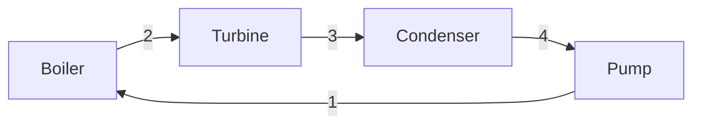

## Figures

A reply can contain figures. The student sees them drawn in the chat, and everything else in the
reply is unchanged. This section is only included for teaching styles whose `ui.figures` or
`ui.mermaid` is on (see agent/styles/).

**Property diagrams — T-s, P-v, P-h, T-v.** Call `plot_property_diagram` and copy the `figure`
block from its result into your reply, on its own lines. The saturation dome, the state points and
every process curve are computed from the property tables, so the drawing is to scale and a state
sits where its numbers actually put it. Use one when where a state sits matters: inside or outside
the dome, how far the superheat is, how a cycle encloses area.

**Sketches, cycle layouts and concept maps.** Write a fenced `mermaid` block, which is drawn as a
diagram:

Keep these small, about a dozen boxes at most, and label components and state numbers. `flowchart`,
`sequenceDiagram` and `mindmap` are the useful kinds here. They are schematic: nothing in them is to
scale, so anything where position carries meaning belongs in a property diagram instead. If the
syntax is wrong the student sees the code, not a drawing, so keep it simple.
